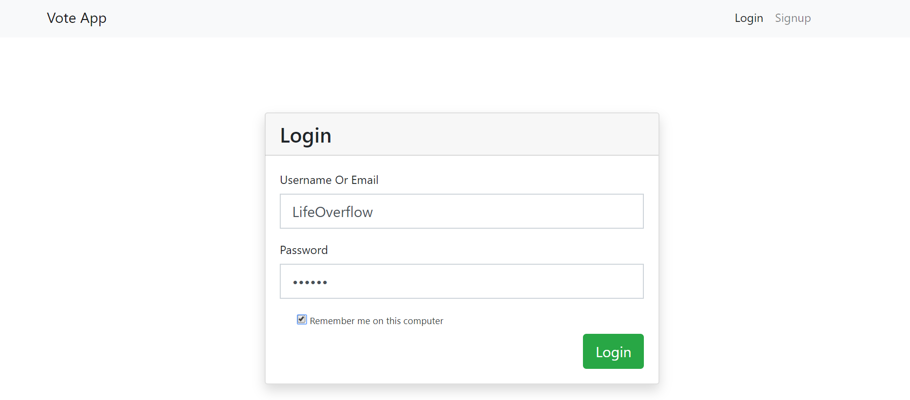
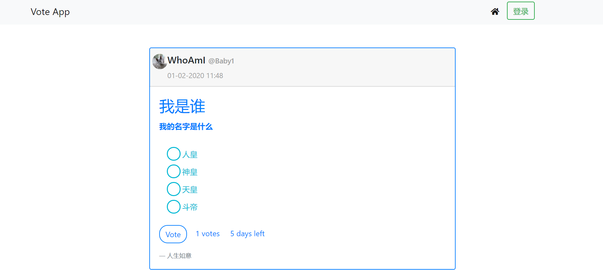
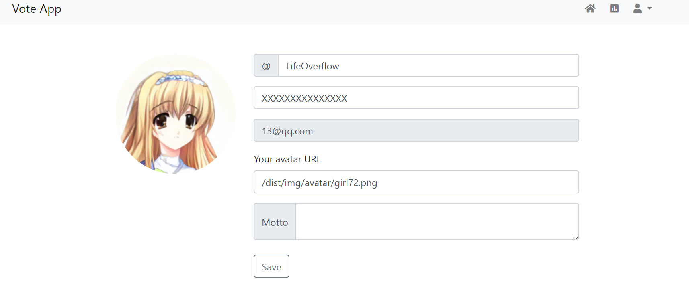
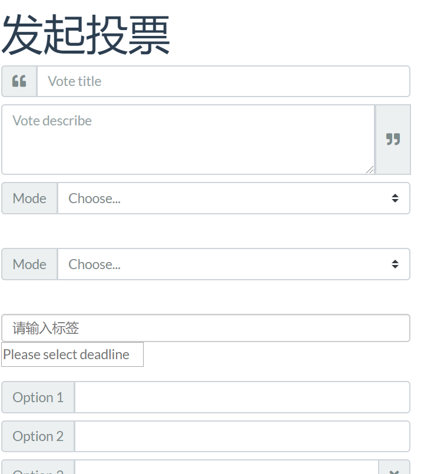
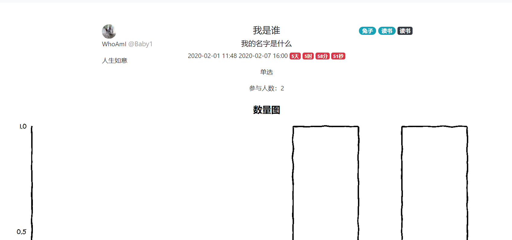
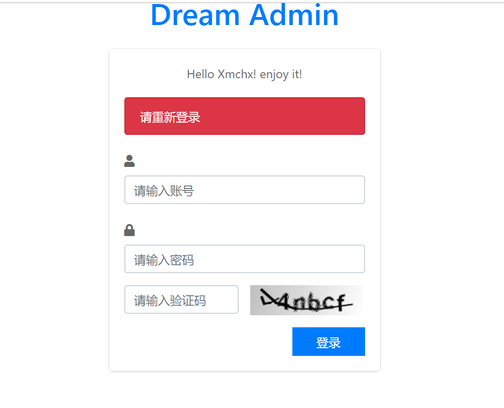
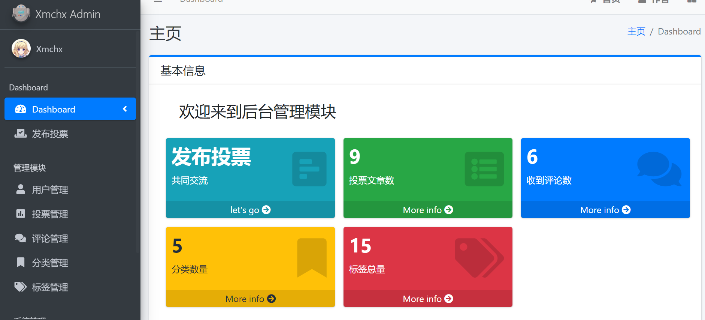

# VoteSystem
> 由于技术水平有限，有许多小bug。完全是一个练手项目，是算得上我个人的第一个web全栈项目，希望以后技术提升，代码写的更好，更优雅。
> 没有太大的问题。已知的一个问题，就是和登陆相关的问题。由于提供了两种用户登陆机制(一套是基于MD5加密的前台用户登陆，一套是基于SpringSecurity的后台登陆)，所以导致了后端登陆时没有权限提示，前端必须也要登陆，并且是Admin账号。太菜了，没考虑清楚。

## 使用教程
第一步修改application.yml文件中的mysql数据库配置。

第二步在数据库中导入并执行vote.sql文件。

第三步在项目的根目录下运行mvn spring-boot:run。

## 技术点

### 业务上的需求如下：

- 用户只有在登录后，才可以生成投票表单。
- 投票项可以单选，可以多选。
- 其它用户投票后显示当前投票结果（但是不能刷票）。
- 投票有相应的时间，页面上需要出现倒计时。
- 投票结果需要用不同颜色不同长度的横条，并显示百分比和人数。

### 技术上的需求如下：

- 这回要用 Java Spring Boot 来实现了，然后，后端不返回任何的 HTML，只返回 JSON 数据给前端。
- 由前端的 JQuery 来处理并操作相关的 HTML 动态生成在前端展示的页面。
- 前端的页面还要是响应式的，也就是可以在手机端和电脑端有不同的呈现。 这个可以用 Bootstrap 来完成。

### 技术栈

#### 后台

- Spring Boot
- Spring Data Jpa
- Spring Security
- Thymeleaf

#### 前端

- BootStrap
- AdminLTE v3.0

### 效果图

