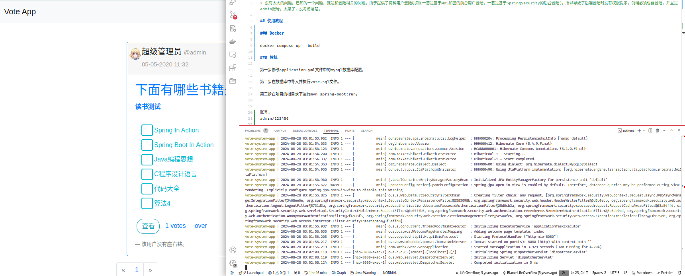

# VoteSystem

> [中文](./README.zh.md)

> This project is a learning exercise and my first full-stack web application. While it functions, there are some minor bugs due to my current skill level. I aim to improve the code quality and elegance as my skills advance.

> One known issue is related to the login system. The application supports two login mechanisms: one for frontend users using MD5 encryption and another for backend users using Spring Security. This dual system causes a lack of permission prompts during backend login, requiring the frontend to also be logged in with an Admin account. This oversight is due to my inexperience.


## Getting Started

### Using Docker

To run the application using Docker, execute the following command in the project root directory:

```sh
docker-compose up
```



### Traditional Setup

1. Configure Database: Modify the application.yml file to update the MySQL database configurations.
2. Initialize Database: Import and execute the vote.sql file in your MySQL database.
3. Run the Application: Navigate to the project root directory and run:
```sh
mvn spring-boot:run
```

### Default Admin Account:

- Username: admin
- Password: 123456


## Technology Stack

### Backend

- Spring Boot: Framework for building the application.
- Spring Data JPA: Simplifies data access and manipulation.
- Spring Security: Handles authentication and authorization.
- Thymeleaf: Templating engine for server-side rendered HTML.


### Frontend

- Bootstrap: Front-end framework for responsive design.
- AdminLTE v3.0: Admin dashboard template.

## References

- [Spring Boot + Spring Security + JWT + MySQL + React Full Stack](https://www.callicoder.com/spring-boot-spring-security-jwt-mysql-react-app-part-1/)


### Screenshots


