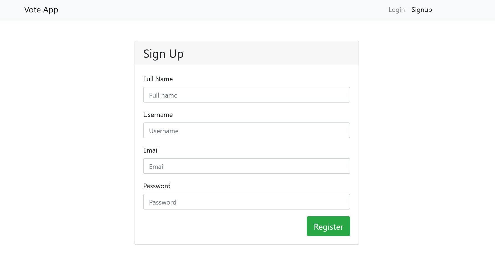
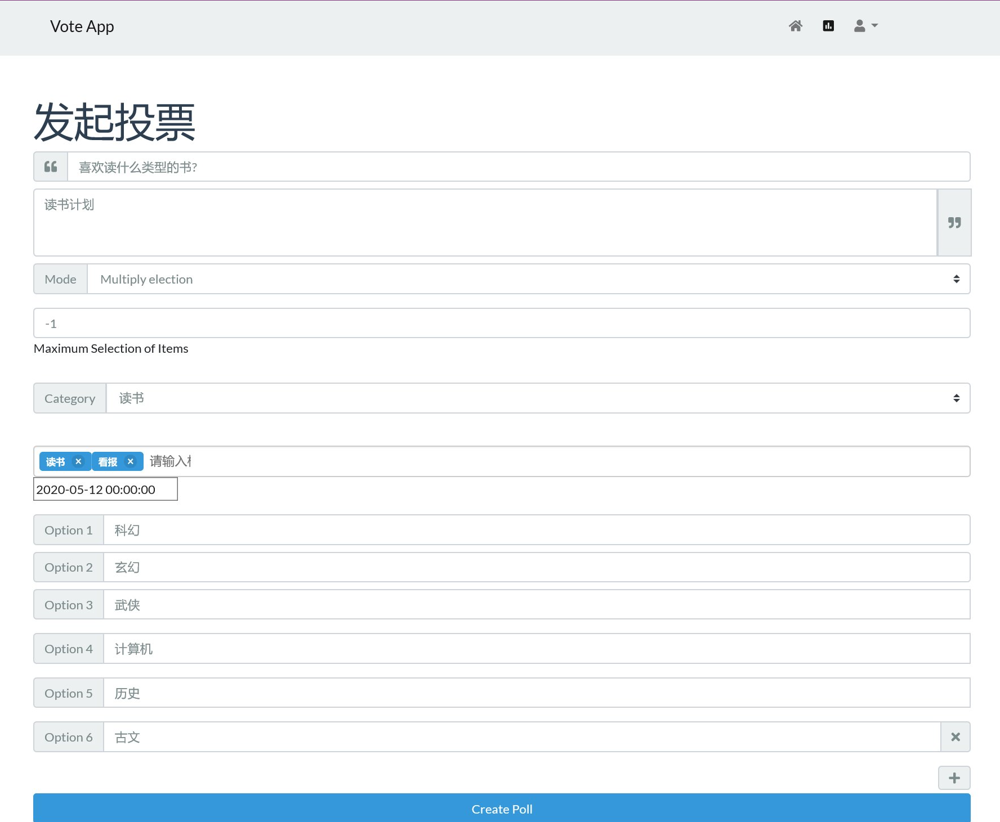
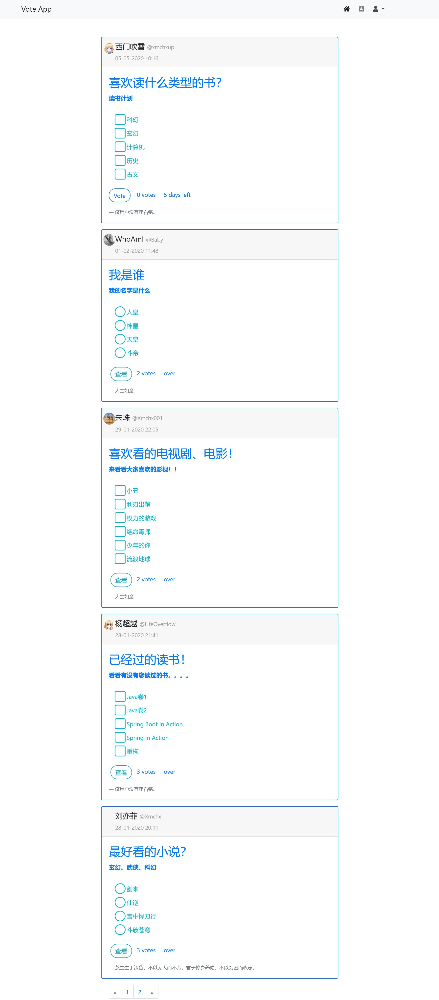

# VoteSystem
> 由于技术水平有限，有许多小bug。目前已知的问题是后台登录进去，如果主页面没有登录，则会跳转(和我写的spring security代码关系)。完全是一个练手项目，是算得上我个人的第一个web全栈项目，希望以后技术提升，在写的更好。
>
> 2021.1.12 最近又跑了一遍，发现用mysql8.0跑起来的效果完全不太行了，全是坑啊。
>
> 2021.4.30 大部分都是环境原因，变成以前用的mysql5.7+jdk8就行了，没有太大的问题。已知的一个问题，就是和我写的spring security代码逻辑有关系(当时只是为了效果而实现的代码，没有考虑太多，框架有些也不熟悉)，登陆后台admin账号，前台账号也必须登陆admin，如果不登陆，则进行相关api操作，会重定向到前端让登陆（隐示的）。前台账号登登录的不是admin账号，有会有权限问题（隐示的）。
>
> 过段时间重构项目，看不下去了。

## 使用教程
第一步修改application.yml文件中的mysql数据库配置。

第二步在数据库中导入并执行vote.sql文件。

第三步在项目的根目录下运行mvn spring-boot:run。

## 技术点

### 业务上的需求如下：

- 用户只有在登录后，才可以生成投票表单。
- 投票项可以单选，可以多选。
- 其它用户投票后显示当前投票结果（但是不能刷票）。
- 投票有相应的时间，页面上需要出现倒计时。
- 投票结果需要用不同颜色不同长度的横条，并显示百分比和人数。

### 技术上的需求如下：

- 这回要用 Java Spring Boot 来实现了，然后，后端不返回任何的 HTML，只返回 JSON 数据给前端。
- 由前端的 JQuery 来处理并操作相关的 HTML 动态生成在前端展示的页面。
- 前端的页面还要是响应式的，也就是可以在手机端和电脑端有不同的呈现。 这个可以用 Bootstrap 来完成。

### 技术栈

#### 后台

- Spring Boot
- Spring Data Jpa
- Spring Security
- Thymeleaf

#### 前端

- BootStrap
- AdminLTE v3.0

### 效果图

