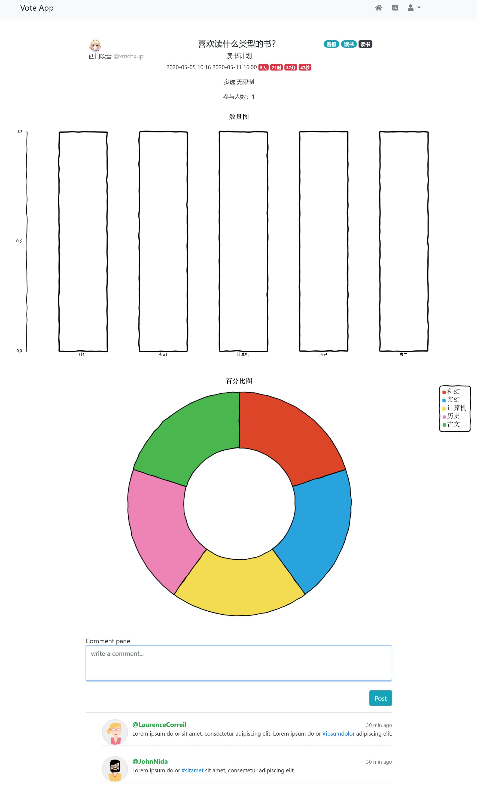

# VoteSystem
a web project for java (spring-boot)

## Steps to Setup the Spring Boot

1.Clone the application
```git
git clone git@github.com:XmchxUp/VoteSystem.git
```
2.Create MySql database
```mysql
create database vote
```
3.Change Mysql username and password as per your MySql installation
- open src/main/resources/application.yaml file.
- change username and password properties as per your mysql installation

4.Run the app
You can run the spring boot app by typing the following command
```
mvn spring-boot:run
```
The server will start on port 8080.

5.Default Roles

The spring boot app uses role based authorization powered by spring security. To add the default roles in the database, I have added the following sql queries in src/main/resources/data.sql file. Spring boot will automatically execute this script on startup -
```mysql
INSERT IGNORE INTO roles(name) VALUES('ROLE_USER');
INSERT IGNORE INTO roles(name) VALUES('ROLE_ADMIN');
INSERT IGNORE INTO roles(name) VALUES('ROLE_PIRATES');
INSERT IGNORE INTO roles(name) VALUES('ROLE_PIRATE_KING');
INSERT IGNORE INTO roles(name) VALUES('ROLE_NAVY');
```
Any new user who signs up to the app is assigned the ROLE_USER by default.

You can't delete the ROLE_USER because a little api should me ROLE_USER

You register user and then you must be update the status of the users table is 1 (1 means enable).

To login to the admin, you must set the uer to admin in user_rolls table. Then
if you want to do anything in the admin, you must be login to the index page

## 技术点

### 业务上的需求如下：

- 用户只有在登录后，才可以生成投票表单。
- 投票项可以单选，可以多选。
- 其它用户投票后显示当前投票结果（但是不能刷票）。
- 投票有相应的时间，页面上需要出现倒计时。
- 投票结果需要用不同颜色不同长度的横条，并显示百分比和人数。

### 技术上的需求如下：

- 这回要用 Java Spring Boot 来实现了，然后，后端不返回任何的 HTML，只返回 JSON 数据给前端。
- 由前端的 JQuery 来处理并操作相关的 HTML 动态生成在前端展示的页面。
- 前端的页面还要是响应式的，也就是可以在手机端和电脑端有不同的呈现。 这个可以用 Bootstrap 来完成。

### 技术栈

#### 后台

- Spring Boot
- Spring Data Jpa
- Spring Security
- Thymeleaf

#### 前端

- BootStrap
- AdminLTE v3.0

### 效果图





